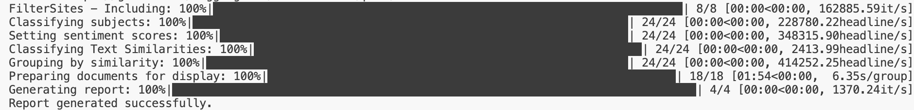
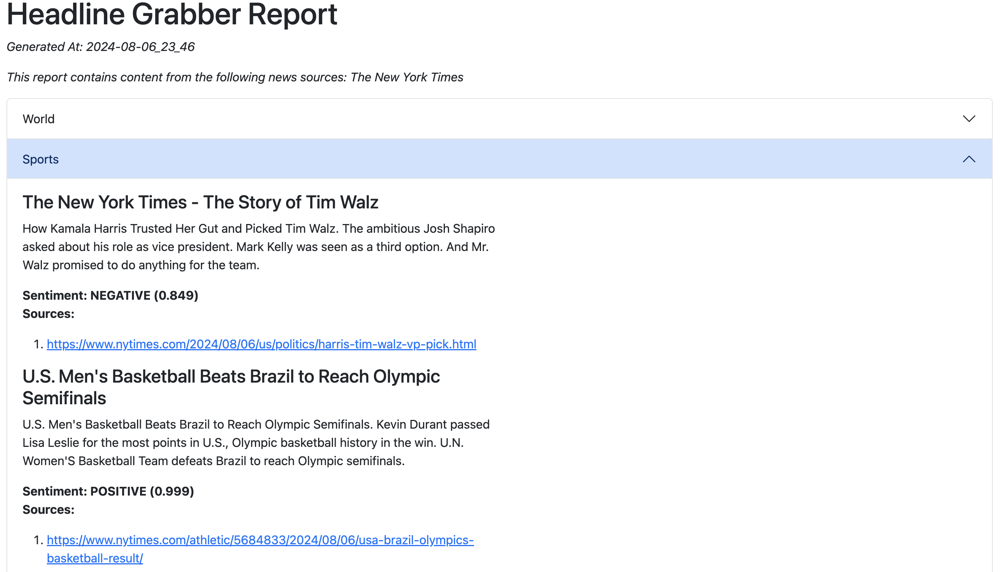

# HEADLINE GRABBER

## Table of Contents

- [HEADLINE GRABBER](#headline-grabber)
  - [Table of Contents](#table-of-contents)
  - [Project Name: Headline Grabber](#project-name-headline-grabber)
  - [Project Description](#project-description)
  - [Group Basic Information](#group-basic-information)
  - [Usage](#usage)
  - [Developer Quick Start](#developer-quick-start)
  - [Unit Testing Report](#unit-testing-report)

## Project Name: Headline Grabber

## Project Description

In the age of information technology, staying informed is crucial. However, time constraints often limit people’s ability to keep up with current events. By providing succinct updates on relevant topics and events, this application ensures that users stay well-informed without sacrificing precious time.

In response to the fast-paced digital landscape, we propose the development of a Python-based news aggregator. This application leverages web scraping techniques to automate the retrieval of news articles from diverse sources. It will provide users with a convenient way to stay informed. Through a user-friendly command-line interface, readers can efficiently access relevant news content.

## Group Basic Information

- GitHub repository: [Link](https://github.com/bdfinlayson/headline_grabber)
- Project Board: [Link](https://github.com/orgs/COSC540-HeadlineGrabber/projects/1/views/3)
- Group Members
  
 | No  | Name                  | GitHub Id   |
 | --- | --------------------- | ----------- |
 | 1   | Ton That Tu Nguyen    | tonthattuit |
 | 2   | Bryan Finlayson       | bdfinlayson |
 | 3   | Sheena Munjal         | smunjal     |
 | 4   | Ryan Mcfarland        | rmcfarl2    |
 | 5   | Zachary Evan Alderman | zalderma    |

## Usage

CMD: headline_grabber.py [OPTIONS]

  Simple program to collect headlines from various news sources and summarize
  them in a helpful way

**Options:**

- -inc, --include TEXT         Comma-separated list of news sources to include in the search
- -exc, --exclude TEXT         Comma-separated list of news sources to exclude
                               from the search
- -td, --target-dir TEXT       The target directory where html news reports
                               should be exported to
- -l, --limit INTEGER          Number specifying the maximum number of entries
                               per topic in a report
- -i, --interactive            Launch interactive menu for preference
                               selection
- -f, --filter-sentiment TEXT  Filters out news headlines ranked positive or
                               negative based on entered value of positive or
                               negative
- -k, --keywords TEXT          Comma-separated list of keywords to search for
                               in news headlines
- --help                       Show this message and exit.

## Developer Quick Start

This project uses Poetry for dependency management, so ensure you've added poetry to your Python environment.

`python -m pip install poetry`

To install project dependencies, cd into the project's root directory and call `poetry install`.
To add dependencies, use `poetry add [name-of-package]`.
To remove dependencies, use `poetry remove [name-of-package]`

## Unit Testing Report

Pytest is used as main lib for unit test. To export the report, use the command below
`python -m pytest --html=<report_name>.html --self-contained-html`
Pytest-cov is used for export code coverage report. To export the HTML coverage report, use the command below
`python -m pytest --cov --cov-report=html`
